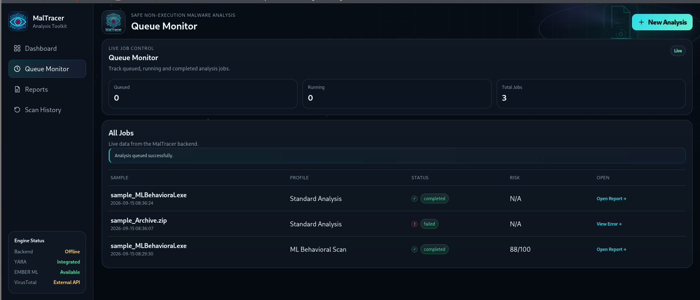
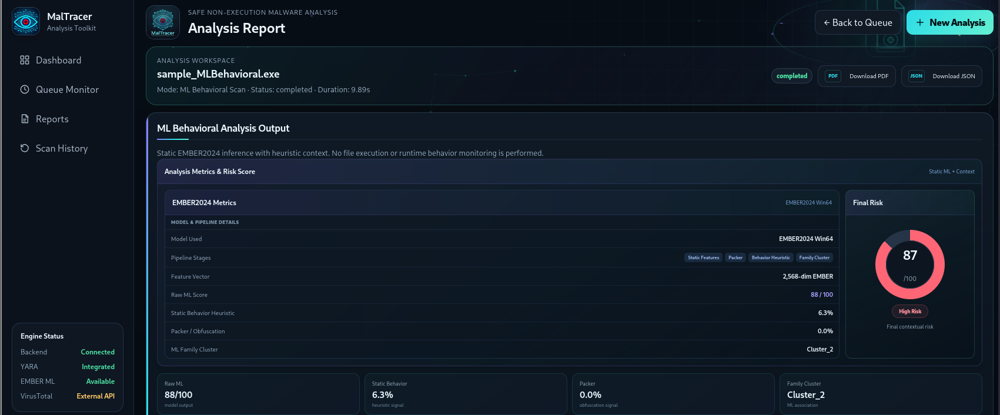
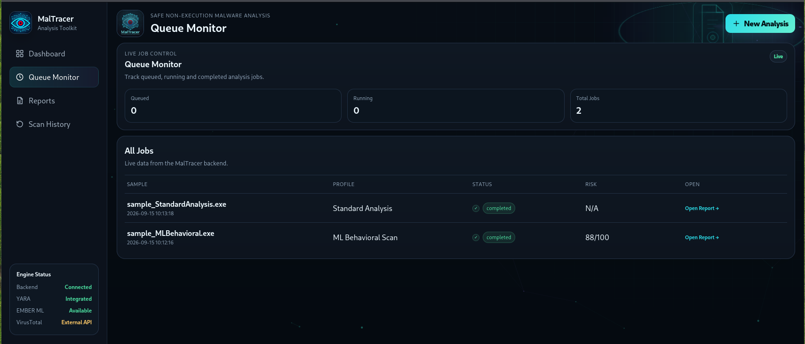

# MalTracer

A hybrid **non-execution malware analysis and threat-intelligence toolkit** for safe, evidence-based triage of suspicious files.

> Final Year Project — Department of Computer Science, Sindh Madressatul Islam University, Karachi

## Overview

MalTracer combines multiple static evidence sources into one structured workflow so analysts can investigate suspicious files **without executing them**. It supports a React web interface with queued jobs, structured reports, and PDF/JSON export.

## Features

- **Smart Auto Analysis** — automatic file-type detection and analyzer routing
- **7 Manual Profiles** — Standard, Document, Archive, Packer, Domain/IOC, Language, ML Behavioral
- **Static PE Analysis** — hashes, sections, imports, strings, categorized Windows APIs
- **YARA rule matching** — bundled Windows / Linux / Multiple rule sets
- **VirusTotal** hash-based reputation lookup
- **MITRE ATT&CK** static capability mapping
- **EMBER2024 Win64** LightGBM model for ML risk inference
- **Structured web reports** with PDF and JSON export
- **Non-execution by design** — suspicious samples are never run

## Tech Stack

| Layer | Technology |
|---|---|
| Frontend | React + Vite |
| Backend | Python 3 + Flask |
| Static Analysis | pefile, LIEF, oletools, python-magic |
| Rule Engine | YARA (yara-python) |
| ML | LightGBM + EMBER2024 Win64 |
| Threat Intel | VirusTotal API v3 |
| Reporting | Custom PDF builder + JSON |

## Setup

### 1. Backend

cd MalTracer
python3 -m venv venv
source venv/bin/activate
pip install -r requirements-linux.txt
python3 Malsecure.py --ui

Backend runs on `http://127.0.0.1:5055`.

### 2. Frontend

cd MalTracer/frontend-react
npm install
npm run dev -- --port 5173

Open `http://localhost:5173`.

### 3. ML Models

Download EMBER2024 models into `MalTracer/ml_analysis/models/`, then install the feature extractor:

pip install -e /path/to/EMBER2024

### 4. VirusTotal (optional)

python3 Malsecure.py --key_init

## Usage

1. Open the dashboard in the browser
2. Upload a sample (max 48 MB)
3. Choose Smart Auto or one of the seven manual profiles
4. Monitor the job in Queue Monitor
5. Open the report, export as PDF or JSON

## Analysis Profiles

| Profile | Purpose |
|---|---|
| Standard Analysis | Static PE analysis + YARA + MITRE + VirusTotal |
| Document | PDF / RTF / OLE / VBScript / macro inspection |
| Archive | ZIP / RAR / ACE member listing and nested triage |
| Packer Detect | Static packer / obfuscation indicators |
| Domain / IOC | URL, IP, domain, email, file-path extraction |
| Language | Programming-language fingerprinting |
| ML Behavioral Scan | EMBER2024 static ML inference + heuristic context |

## Safety Model

MalTracer performs **static, non-execution analysis only**. It is designed as a preliminary triage and decision-support toolkit and does **not** replace sandboxing, enterprise EDR, or manual reverse engineering.

## Authors

- **Zahid Hussain** — CSC-22F-198
- **Zulfiqar Ali** — CSC-22F-146
- **Abdul Basit** — CSC-22F-148

**Supervisor:** Dr. Syeda Nazia Ashraf  
**Department of Computer Science**  
Sindh Madressatul Islam University, Karachi

## Screenshots

### Analysis Dashboard

### ML Behavioral Report

### Queue Monitor

